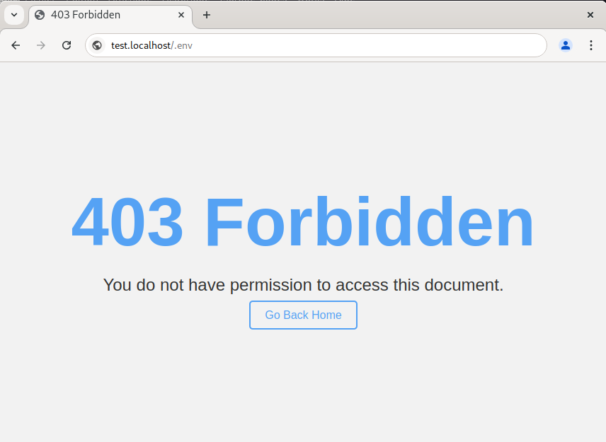

# Traefik Sensitive file blocker plugin


This plugin allows Traefik users to block access to sensitive files and directories that should not be publicly accessible. Common examples of sensitive files are .env files, .git/ directories, and other configuration or version control files that could expose private data or system vulnerabilities if accessed externally.


[](https://github.com/glefer/sensitive-files-blocker/actions)
[](https://codecov.io/github/glefer/sensitive-files-blocker)
[](https://goreportcard.com/report/github.com/glefer/sensitive-files-blocker)


## Preview



## Features
* Blocks predefined sensitive files.
* Customizable list of files or directories to block.
* Lightweight and easy to install as a Traefik middleware plugin.
* Flexible installation methods: via Traefik Pilot, local mode, or Docker.
* Templating support for custom error pages.

## Installation
It is possible to install the [plugin locally](https://traefik.io/blog/using-private-plugins-in-traefik-proxy-2-5/) or to install it through [Traefik Pilot](https://pilot.traefik.io/plugins).


### Traefik plugin registry

This procedure will install the plugin via the [Traefik Plugin registry](https://plugins.traefik.io/install).

Add this configuration in your `traefik.yml` file.

```yaml
experimental:
  plugins:
    sensitive-files-blocker:
      moduleName: "github.com/glefer/sensitive-files-blocker"
      version: "v0.0.1"
```
### Local Mode

Download the latest release of the plugin and save it to a location the Traefik container can reach. 

```bash
git clone git@github.com:glefer/sensitive-files-blocker.git
```


The source code of the plugin should be organized as follows:

```
./plugins-local/
    └── src
        └── github.com
            └── glefer
                └── sensitive-files-blocker
                    ├── .assets/
                    ├── .github/
                    ├── .gitignore
                    ├── .traefik.yml
                    ├── go.mod
                    ├── LICENSE
                    ├── main.go
                    ├── main_test.go
                    ├── Makefile
                    └── readme.md
```

```yaml
# Static configuration
experimental:
  localPlugins:
    sensitive-files-blocker:
      moduleName: github.com/glefer/sensitive-files-blocker
```

(In the above example, the `sensitive-files-blocker` plugin will be loaded from the path `$GOPATH/plugins-local/src/github.com/glefer/sensitive-files-blocker`.)


> If `$GOPATH` is not set, plugins-local must be placed at the root of the server.

### Docker

To run this plugin in a Docker environment, add the following configuration to your compose.yml file to mount `plugins-local` directory in the right container path.

```yaml

services:
  traefik:
    image: "traefik:v3.1"
    container_name: "traefik"
    ports:
      - "80:80"
      - "443:443"
    volumes:
      - "/var/run/docker.sock:/var/run/docker.sock:ro"
      - "/path/to/plugins-local/:/plugins-local/"

```


## Configuration

Here is an example of a file provider dynamic configuration (given here in YAML), where the interesting part is the `http.middlewares` section:

```yaml
# Dynamic configuration
http:
  middlewares:
    sensitive-files-blocker:
      plugin:
        sensitive-files-blocker:
          files:
            - composer.json
            - composer.lock
          filesRegex:
            - ^.*\.env$
            - ^.*\.git
          logs:
            enabled: false
            filePath: /var/log/sensitive-files-blocker.log
```

The configuration for the sensitive files blocker includes two main sections: files and filesRegex.

### Files
The files section is used to specify exact filenames that should be blocked. These filenames should be an exact match for the files you want to block. For example:

```yaml
files:
  - composer.json
  - composer.lock
```

In this example, composer.json and composer.lock are exact filenames. Any request to access these files will be blocked.

### FilesRegex
The filesRegex section is used to specify regular expressions that match the filenames you want to block. This allows you to block a group of files based on a pattern. For example:

```yaml
filesRegex:
  - ^.*\.env$
  - ^.*\.git
```

In this example, `^.*\.env$` will block any file that ends with .env, and `^.*\.git` will block any file that ends with .git. The ^ symbol represents the start of the filename, the .* allows for any characters in the middle, and the $ symbol represents the end of the filename.

Please note that you need to escape the . character with a backslash (\.) because . is a special character in regular expressions that matches any character. If you want to match the . character exactly, you need to escape it.

### Logging
In the logs section of the Traefik plugin configuration, you can control how logs are handled for the sensitive-files-blocker middleware.

* `enabled` (default: false): This parameter determines whether logging is activated. If set to true, the plugin will log all events related to blocking attempts on sensitive files. If set to false, no logs will be recorded, and log information will be suppressed.
* `filePath`: This parameter specifies the location of the log file where the plugin will write log data when logging is enabled.

### Enable middleware for all routers

In order to enable this middleware for all routers, you can add this configuration in the `traefik.yml` file.

```yaml
entryPoints:
  http:
    address: ":80"
    http:
      middlewares:
        - sensitive-files-blocker@file
```

This configuration ensures that any requests going through all routers will have the sensitive file blocker middleware applied.


### Enable Middleware for a Specific Router (YAML Format)
```yaml
http:
  routers:
    Router-1:
      rule: "Host(`example.com`)"
      service: "service-1"
      middlewares:
        - sensitive-files-blocker@file
```

### Enable Middleware for a Specific Router (docker compose format)
```yaml
services:
  my-container:
    # ...
    labels:
      - "traefik.http.routers.my-container.rule=Host(`example.com`)"
      - "traefik.http.routers.my-app.entrypoints=websecure"
      - "traefik.http.routers.my-app.tls.certresolver=myresolver"
      - "traefik.http.middlewares.my-app-blocker.plugin.sensitive-files-blocker.files=^.env$,^.git"

```

## Templating
### Configuration
Configure a template for blocking access to sensitive files:

```yaml
# Dynamic configuration
http:
  middlewares:
    sensitive-files-blocker:
      plugin:
        sensitive-files-blocker:
          files:
          # ...
          template:
            enabled: true
            css: 'body { font-family: Arial, sans-serif; } h1 { color: red; }'
            html: '<html><head><title>{{ .Title }}</title></head><body><h1>{{ .Title }}</h1><p>{{ .Message }}</p></body></html>'
            vars:
              title: 'Access denied'
              message: 'You are not allowed to access this file.'
```

### Disable Templating
To disable templating, set the `enabled` field to `false`:

```yaml
# Dynamic configuration
http:
  middlewares:
    sensitive-files-blocker:
      plugin:
        sensitive-files-blocker:
          files:
          # ...
          template:
            enabled: true
            css: 'body { font-family: Arial, sans-serif; } h1 { color: red; }'
            html: '<html><head><title>{{ .Title }}</title></head><body><h1>{{ .Title }}</h1><p>{{ .Message }}</p></body></html>'
            vars:
              title: 'Access denied'
              message: 'You are not allowed to access this file.'
```
## Testing

To run tests, you can use the following command:
```bash
make test
```

To run tests in yaegi mode, you can use the following command:
```bash
make yaegi_test
```

## Contributing

Contributions are welcome! Feel free to open issues, submit pull requests, or suggest new features.
Testing


This will run all tests defined in main_test.go.

## License

This project is licensed under the MIT License. See the LICENSE file for more details.
